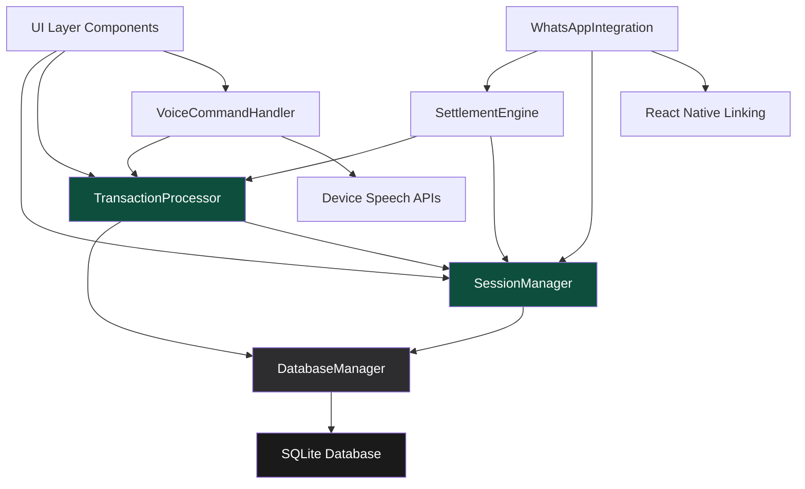

# Components

Based on the architectural patterns, tech stack, and data models, the major logical components across PokePot's monolithic mobile architecture:

## SessionManager Component

**Responsibility:** Orchestrates session lifecycle, player management, and state coordination for poker night tracking

**Key Interfaces:**
- `createSession(name: string): Promise<Session>` - Initialize new poker night session
- `addPlayer(sessionId: string, playerData: PlayerData): Promise<Player>` - Add participant to session
- `getSessionState(sessionId: string): Promise<SessionState>` - Retrieve current session status and players

**Dependencies:** DatabaseService for persistence, ValidationService for business rules

**Technology Stack:** TypeScript service class with Zustand state management, SQLite integration via react-native-sqlite-storage

## TransactionProcessor Component

**Responsibility:** Handles all buy-in and cash-out transaction recording, validation, and balance calculations

**Key Interfaces:**
- `recordBuyIn(playerId: string, amount: number, method: TransactionMethod): Promise<Transaction>` - Process buy-in transaction
- `recordCashOut(playerId: string, amount: number): Promise<Transaction>` - Process cash-out transaction
- `calculatePlayerBalance(playerId: string): Promise<PlayerBalance>` - Real-time balance computation

**Dependencies:** SessionManager for session validation, DatabaseService for transaction persistence

**Technology Stack:** TypeScript business logic with React Query for optimistic updates, SQLite transactions for data integrity

## SettlementEngine Component

**Responsibility:** Performs early cash-out calculations and final settlement optimization algorithms

**Key Interfaces:**
- `calculateEarlyCashOut(playerId: string): Promise<EarlyCashOutResult>` - Instant mid-game settlement calculation
- `optimizeFinalSettlement(sessionId: string): Promise<OptimizedSettlement>` - Minimize payment transactions algorithm
- `validateSettlement(settlement: Settlement): Promise<ValidationResult>` - Mathematical verification of settlement accuracy

**Dependencies:** TransactionProcessor for balance data, SessionManager for player information

**Technology Stack:** TypeScript algorithms with potential native module for performance-critical calculations, comprehensive Jest testing for financial accuracy

## VoiceCommandHandler Component

**Responsibility:** Processes voice recognition input and converts speech to transaction commands

**Key Interfaces:**
- `startListening(): Promise<void>` - Activate device speech recognition
- `processCommand(audioInput: string, context: SessionContext): Promise<CommandResult>` - Parse and execute voice commands
- `validatePlayerName(spokenName: string, sessionPlayers: Player[]): Promise<string | null>` - Match voice input to session participants

**Dependencies:** TransactionProcessor for command execution, SessionManager for player context

**Technology Stack:** @react-native-community/voice for speech recognition, custom TypeScript command parsing logic, iOS Speech Framework / Android SpeechRecognizer APIs

## WhatsAppIntegration Component

**Responsibility:** Formats session results and handles social sharing via WhatsApp URL schemes

**Key Interfaces:**
- `formatSettlementMessage(settlement: Settlement, format: MessageFormat): string` - Create shareable settlement summary
- `shareToWhatsApp(message: string): Promise<ShareResult>` - Launch WhatsApp with pre-filled message
- `generateQRCode(sessionId: string): Promise<string>` - Create session joining QR code

**Dependencies:** SettlementEngine for settlement data, SessionManager for session information

**Technology Stack:** React Native Linking API for URL schemes, react-native-qrcode-generator, clipboard fallback for sharing reliability

## DatabaseManager Component

**Responsibility:** Abstracts SQLite operations and manages local data persistence with encryption

**Key Interfaces:**
- `executeQuery<T>(query: string, params: any[]): Promise<T[]>` - Execute database operations
- `initializeSchema(): Promise<void>` - Set up database tables and indexes
- `cleanupExpiredSessions(): Promise<void>` - Privacy-compliant data removal

**Dependencies:** None (foundational component)

**Technology Stack:** react-native-sqlite-storage with WAL mode, AES-256 encryption, connection pooling for performance

## Component Diagrams

