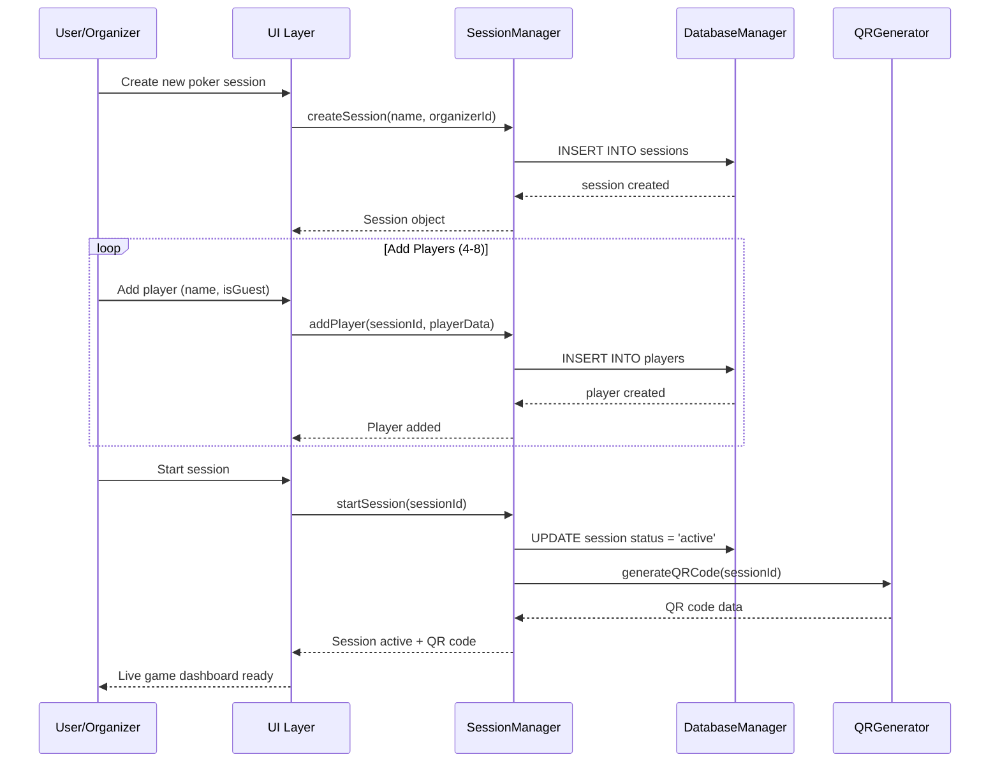
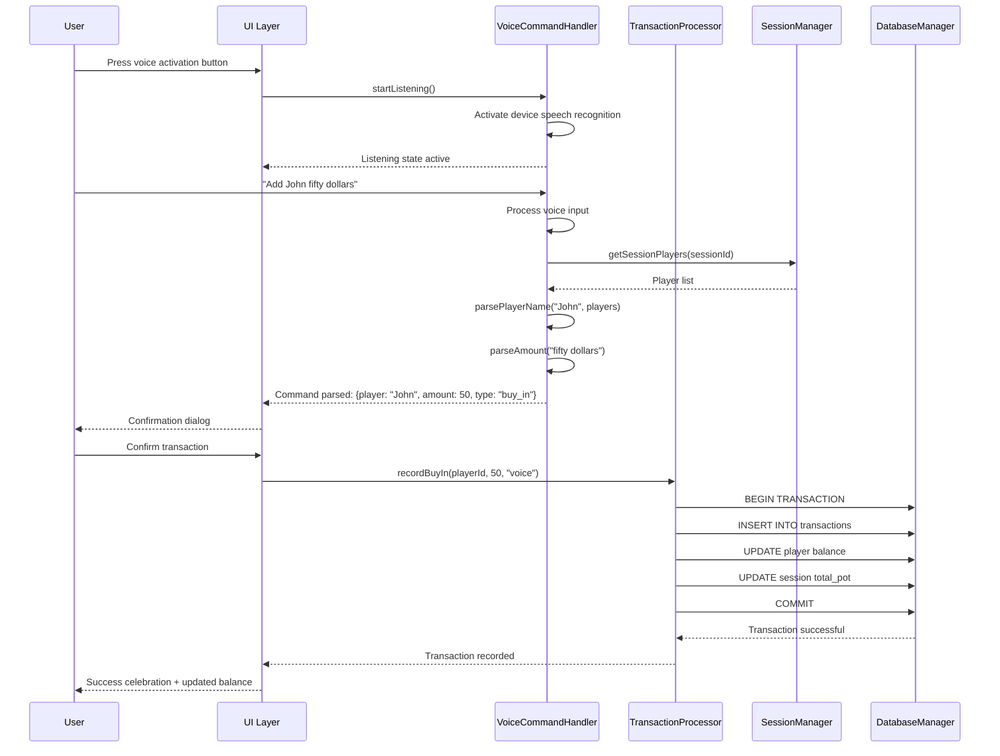
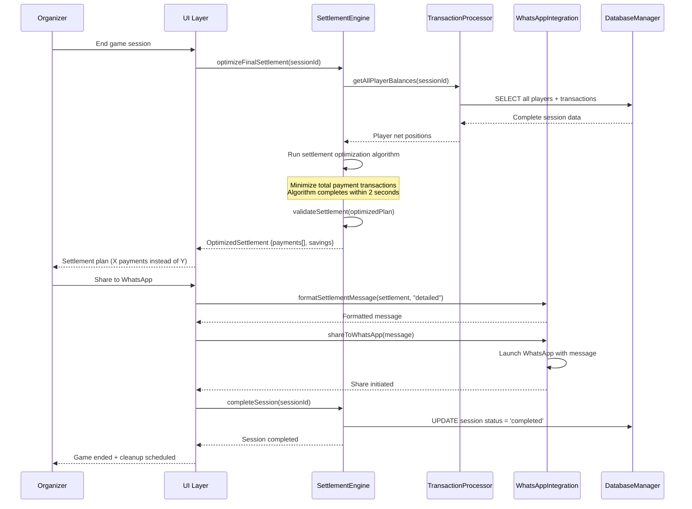

# Core Workflows

Key system workflows using sequence diagrams to illustrate critical user journeys and component interactions:

## Workflow 1: Session Creation and Player Onboarding

## Workflow 2: Voice-Enabled Transaction Recording

## Workflow 3: Settlement Optimization

