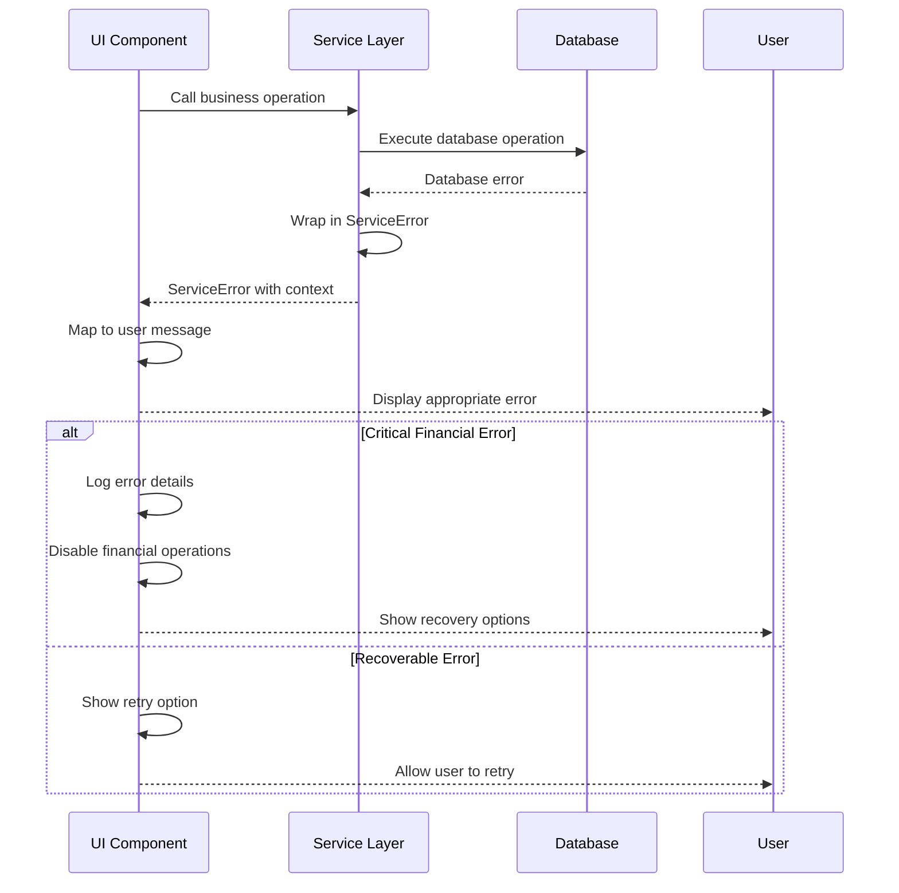

# Error Handling Strategy

Define unified error handling across PokePot's React Native frontend and embedded service layer:

## Error Flow



## Error Response Format

```typescript
interface ServiceError extends Error {
  code: 'VALIDATION_ERROR' | 'CALCULATION_ERROR' | 'DATABASE_ERROR' | 'VOICE_ERROR' | 'SETTLEMENT_ERROR' | 'AUTHORIZATION_ERROR';
  message: string;
  details?: Record<string, any>;
  timestamp: Date;
  sessionId?: string;
  playerId?: string;
  recoverable: boolean;
  retryable: boolean;
}
```

## Frontend Error Handling

Critical financial operations use error boundaries to prevent app crashes:

```typescript
export class FinancialErrorBoundary extends React.Component<
  { children: React.ReactNode },
  { hasError: boolean; error?: ServiceError }
> {
  static getDerivedStateFromError(error: Error): { hasError: boolean; error: ServiceError } {
    const serviceError = error instanceof ServiceError 
      ? error 
      : new ServiceError('CALCULATION_ERROR', error.message);
      
    return { hasError: true, error: serviceError };
  }

  render() {
    if (this.state.hasError && this.state.error) {
      return (
        <FinancialErrorFallback 
          error={this.state.error}
          onRetry={() => this.setState({ hasError: false })}
        />
      );
    }

    return this.props.children;
  }
}
```
