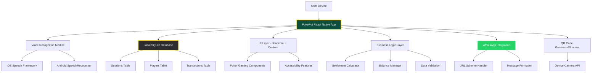

# High Level Architecture

## Technical Summary

PokePot employs a **monolithic React Native architecture** with local SQLite storage, eliminating traditional client-server complexity for a streamlined poker night companion. The application uses **TypeScript throughout** for type safety, **on-device voice recognition APIs** for hands-free interaction, and **shadcn/ui components** extended with poker-specific gaming elements for optimal user experience. **Local-first data management** ensures instant responsiveness and complete offline functionality, while **WhatsApp URL scheme integration** enables seamless social sharing without backend dependencies. This architecture achieves the PRD goals of transforming chaotic money tracking into an entertaining, dispute-free experience through mathematical certainty and celebration-focused interactions.

## Platform and Infrastructure Choice

**Platform:** React Native (iOS/Android)  
**Key Services:** Local SQLite database, device speech recognition APIs, WhatsApp URL schemes, platform camera APIs (QR codes)  
**Deployment Host and Regions:** App Store (iOS) and Google Play Store (Android) - global distribution

## Repository Structure

**Structure:** Single repository monolith  
**Monorepo Tool:** Not applicable - single React Native project  
**Package Organization:** Feature-based folder structure with shared utilities

## High Level Architecture Diagram

## Architectural Patterns

- **Local-First Architecture:** All data operations happen locally with SQLite, eliminating network dependencies and ensuring instant response times - _Rationale:_ Enables 100% offline functionality and eliminates complex sync logic for short-lived poker sessions

- **Component-Based UI:** React Native components with shadcn/ui foundation extended with poker-specific gaming elements - _Rationale:_ Maintainability and accessibility compliance while providing poker-optimized user experience

- **Service Layer Pattern:** Business logic abstracted into services (SettlementService, VoiceService, DatabaseService) - _Rationale:_ Separates concerns and enables easier testing of complex financial calculations

- **Event-Driven Voice Commands:** Voice recognition triggers events processed by command handlers - _Rationale:_ Decouples speech recognition from business logic and enables easy command vocabulary expansion

- **Repository Pattern:** Abstract data access layer over SQLite operations - _Rationale:_ Provides clean interface for database operations and enables future data layer modifications if needed
