# PokePot Front-End Specification v2.0

## 1. Introduction

### UX Goals & Design Philosophy
PokePot embraces a **"game night companion"** design philosophy - creating an interface that feels like a helpful friend handling tedious calculations while staying invisible during actual poker play. The monolithic mobile architecture enables **instant offline performance** with local SQLite storage, eliminating network dependencies that could disrupt gameplay.

The design prioritizes a **party atmosphere** that amplifies the social entertainment of poker nights, while maintaining **mobile-first simplicity** for effortless interaction during gameplay. Every interaction is optimized for **performance** through local-first data management and **social-centric** features that seamlessly integrate with existing WhatsApp group dynamics.

### Primary User Personas
1. **Game Organizer** - Creates sessions, manages player roster, handles final settlements
2. **Active Player** - Records buy-ins/cash-outs via voice or touch during gameplay  
3. **Early Leaver** - Needs instant cash-out calculations for mid-game departures

### Core Design Principles  
- **Voice-First, Touch-Secondary**: Primary interactions through hands-free voice commands with visual confirmations
- **Party Celebration Focus**: Every successful transaction includes delightful micro-celebrations
- **Poker Room Optimized**: Dark mode default, large touch targets (88x88pt minimum), high contrast for dim lighting
- **Mathematical Certainty**: Every calculation transparent, verifiable, dispute-proof
- **Social Integration**: Seamless WhatsApp sharing with pre-formatted, mobile-optimized settlement messages
- **Performance-Optimized**: Local SQLite operations complete within 100ms for instant responsiveness

## 2. Information Architecture

### Site Map & Navigation Structure

```mermaid
graph TD
    A[App Launch] --> B[Party Dashboard Hub]
    B --> C[🎉 Create New Game]
    B --> D[📱 Join Game via QR]
    B --> E[🎲 Recent Games]
    
    C --> F[Session Setup]
    F --> G[Add Players]
    G --> H[🚀 Game Dashboard]
    
    D --> I[QR Scanner]
    I --> J[Player View Only]
    
    H --> K[🎤 Voice Commands]
    H --> L[Quick Actions]
    H --> M[Live Balance View]
    
    H --> N[💰 Early Cash-out]
    N --> O[Instant Settlement]
    
    H --> P[🏁 End Game]
    P --> Q[Final Settlement]
    Q --> R[📱 WhatsApp Share]
    
    E --> S[Game History]
    S --> T[Session Details]
```



### Navigation Architecture
**Party Dashboard + Context-Aware Floating + Progressive Disclosure**

- **Party Dashboard Hub**: Central celebration-focused interface that adapts based on game state
- **Context-Aware Floating Actions**: Buttons and panels that appear based on current context (playing, settling, sharing)
- **Progressive Disclosure**: Show only relevant options - players see buy-in options during play, settlement options at game end

### Information Hierarchy Priority
1. **Current balances** (always visible during gameplay with celebration animations)
2. **Quick action buttons** (buy-in, cash-out, voice activation with party styling)
3. **Session status** (time, player count, total pot with poker chip visualizations)
4. **Settlement options** (early cash-out, final optimization with social sharing)

## 3. User Flows & Critical Journeys

### Critical User Flow 1: Session Creation & Game Start

```mermaid
flowchart TD
    A[Launch App] --> B{First Time?}
    B -->|Yes| C[🎉 Celebration Onboarding]
    B -->|No| D[Party Dashboard]
    
    C --> D
    D --> E[🎰 Start New Game]
    E --> F[Session Name Input]
    F --> G[Add Players Hub]
    
    G --> H{Player Count}
    H -->|< 4| I[Add More Players Prompt]
    H -->|4-8| J[✅ Ready to Party]
    H -->|> 8| K[❌ Max Players Warning]
    
    I --> L[Quick Add Regular Players]
    L --> G
    J --> M[🚀 Launch Game Dashboard]
    K --> G
    
    M --> N[🎲 Live Game Interface]
    N --> O[Context-Aware Actions]
    O --> P[Voice/Touch Buy-ins]
```



### Critical User Flow 2: Live Gameplay & Voice Commands

```mermaid
flowchart TD
    A[🎲 Game Dashboard] --> B{Action Type?}
    
    B -->|Voice| C[🎤 Voice Activation]
    B -->|Touch| D[Quick Action Panel]
    B -->|View| E[Live Balance Cards]
    
    C --> F[Speech Recognition]
    F --> G{Command Clear?}
    G -->|Yes| H[🎊 Transaction Animation]
    G -->|No| I[Clarification Dialog]
    
    D --> J[Player Selection]
    J --> K[Amount Entry]
    K --> H
    
    I --> L{Retry or Manual?}
    L -->|Retry| C
    L -->|Manual| D
    
    H --> M[Balance Update]
    M --> N[🎉 Success Celebration]
    N --> O[Return to Dashboard]
    
    E --> P[Player Status Cards]
    P --> Q[Tap for Details]
    Q --> O
```



### Critical User Flow 3: QR Code Joining Experience

```mermaid
flowchart TD
    A[Player Wants to Join] --> B[📱 Open Camera/QR App]
    B --> C[Scan QR Code]
    C --> D{QR Valid?}
    
    D -->|No| E[❌ Invalid Code Error]
    D -->|Yes| F[🎉 Opening PokePot...]
    
    E --> G[Try Again Prompt]
    G --> B
    
    F --> H[🎲 Read-Only Player View]
    H --> I[Your Balance Card]
    I --> J[Live Transaction Feed]
    
    J --> K{New Transaction?}
    K -->|Yes| L[🎊 Balance Update Animation]
    K -->|No| M[Refresh/Wait State]
    
    L --> N[Updated Balance Display]
    M --> K
    N --> K
```



### Critical User Flow 4: WhatsApp Sharing Flow

```mermaid
flowchart TD
    A[🏁 Game Ends] --> B[Final Settlement Screen]
    B --> C[🎉 Settlement Complete!]
    C --> D[Share Results Button]
    
    D --> E{Share Format?}
    E -->|Quick| F[📱 Summary Format]
    E -->|Detailed| G[📄 Full Breakdown]
    E -->|Visual| H[📊 Image Export]
    
    F --> I[WhatsApp URL Scheme]
    G --> I
    H --> I
    
    I --> J{WhatsApp Available?}
    J -->|Yes| K[📱 Open WhatsApp]
    J -->|No| L[📋 Copy to Clipboard]
    
    K --> M[Pre-filled Message]
    M --> N[Select Chat/Group]
    N --> O[Send Message]
    O --> P[🎊 Shared Successfully]
    
    L --> Q[Share Another Way?]
    Q --> R[Alternative Sharing Options]
    
    P --> S[Return to Dashboard]
    R --> S
```



### Critical User Flow 5: Offline/Online Sync & Local Data

```mermaid
flowchart TD
    A[App Launch] --> B[📱 Local SQLite Check]
    B --> C{Database Ready?}
    
    C -->|No| D[Initialize DB]
    C -->|Yes| E[Load Session Data]
    
    D --> F[Create Schema]
    F --> G[Set Encryption]
    G --> E
    
    E --> H[🎲 Offline-First Interface]
    H --> I[All Operations Local]
    
    I --> J{Need to Share?}
    J -->|No| K[Continue Playing]
    J -->|Yes| L[Check Network]
    
    L --> M{Connected?}
    M -->|Yes| N[WhatsApp Integration]
    M -->|No| O[Queue for Later]
    
    N --> P[Share Message]
    O --> Q[📱 Offline Banner]
    
    P --> R[✅ Shared]
    Q --> S[Retry When Online]
    
    K --> T[Auto Cleanup Timer]
    T --> U{8-12 Hours Later}
    U --> V[🗑️ Privacy Cleanup]
    
    R --> K
    S --> L
```



## 4. Component Library & shadcn Integration

### Design System Architecture
**Gaming-Optimized + Accessible Party + Hybrid Library Approach**

The component library combines shadcn/ui's production-ready accessibility foundation with poker-specific gaming components and React Native native elements for optimal performance and platform integration.

### Core Component Categories

#### 1. shadcn/ui Base Components (Utility & Structure)
```typescript
import { 
  Button, Card, CardContent, CardHeader,
  Dialog, DialogContent, DialogHeader,
  Toast, Toaster, Badge, Input,
  Select, Progress, AlertDialog,
  Switch, Slider, ScrollArea
} from "@/components/ui"
```

#### 2. Poker-Specific Gaming Components (Custom)
```typescript
// Large touch targets optimized for poker gameplay
export const ChipStack = ({ amount, animated, color }: ChipStackProps) => {
  // WCAG AA: aria-label, high contrast, screen reader support
  // Gaming: Realistic chip stack visualization with physics
  // Performance: React Native Reanimated 3 optimizations
  return (
    <TouchableOpacity 
      style={{ minHeight: 88, minWidth: 88 }}
      accessibilityLabel={`${amount} dollar chip stack`}
    >
      <Animated.View>{/* Chip stack animation */}</Animated.View>
    </TouchableOpacity>
  )
}

export const PokerTable = ({ players, pot }: PokerTableProps) => {
  // Gaming: Felt background, chip animations, player positions
  // Accessible: Voice navigation, focus indicators, text scaling
  // Hybrid: React Native View + shadcn Card components
  return (
    <View style={styles.pokerFelt}>
      {players.map(player => 
        <PlayerBalanceCard key={player.id} {...player} />
      )}
    </View>
  )
}

export const VoiceCommandPanel = ({ 
  listening, command, confidence 
}: VoiceCommandProps) => {
  return (
    <Dialog open={listening}>
      <DialogContent>
        <VoiceMicrophone animated={listening} />
        <Text accessibilityLiveRegion="polite">
          {command && `Heard: ${command} (${Math.round(confidence * 100)}% confidence)`}
        </Text>
        <Button onClick={handleConfirm}>Confirm</Button>
        <Button variant="outline" onClick={handleRetry}>Try Again</Button>
      </DialogContent>
    </Dialog>
  )
}
```

#### 3. React Native Native Components (Platform Integration)
```typescript
import { 
  View, Text, TouchableOpacity, Animated,
  Vibration, Dimensions, StatusBar,
  PermissionsAndroid, Camera
} from 'react-native'

import Voice from '@react-native-community/voice'
import SQLite from 'react-native-sqlite-storage'
```

### Party Celebration System
```typescript
export const CelebrationManager = {
  // WCAG AA compliant animations (respect prefers-reduced-motion)
  buyInSuccess: () => {
    if (!prefersReducedMotion) {
      chipStackAnimation.start()
      Vibration.vibrate(100)
    }
    playSuccessSound()
  },
  
  bigWin: () => {
    if (!prefersReducedMotion) {
      confettiAnimation.start()
      Vibration.vibrate([100, 200, 100])
    }
    playVictorySound()
  },
  
  perfectBalance: () => {
    if (!prefersReducedMotion) {
      sparkleEffect.start()
    }
    playCelebrationSound()
  }
}
```

### Component Theming Strategy
```typescript
// shadcn theme extended with poker aesthetics
const pokerTheme = {
  ...defaultTheme,
  colors: {
    ...defaultTheme.colors,
    primary: '#0D4F3C', // Poker felt green
    accent: '#FFD700',  // Gold chip
    success: '#228B22', // Winning green
    warning: '#DC143C', // Red chip warning
    background: '#1A1A1A', // Dark casino
  },
  spacing: {
    ...defaultTheme.spacing,
    touch: 44,      // Minimum touch target
    comfortable: 88, // Poker-friendly large targets
  }
}
```

## 5. Screen Specifications & Wireframes

### 5.1 Party Dashboard Hub (Home Screen)
**Purpose:** Central celebration-focused entry point that adapts based on user state

**Layout:**
- Hero section with party branding and current session status
- Context-aware action cards (Create Game, Join Game, Resume Game)
- Recent games carousel with celebration highlights
- Quick stats: total games, biggest wins, favorite players

**Components:**
- `PartyWelcome` (Custom + shadcn Card)
- `ActionGrid` (shadcn Button + custom party styling)
- `RecentGamesCarousel` (React Native FlatList + shadcn Card)
- `QuickStats` (Custom visualization + shadcn Badge)

### 5.2 Live Game Dashboard (Primary Interface)
**Purpose:** Real-time balance display with context-aware floating actions

**Layout:**
- Poker table visualization with player balance cards arranged in circle
- Central pot display with animated chip stack
- Floating action buttons for voice commands and quick transactions
- Session timer and game status indicators

**Components:**
- `PokerTableLayout` (Custom React Native View)
- `PlayerBalanceCard` (Hybrid shadcn Card + custom animations)
- `CentralPot` (Custom ChipStack component)
- `FloatingActionPanel` (Custom TouchableOpacity + shadcn Button)
- `VoiceActivationButton` (Custom with microphone animation)

### 5.3 Settlement Summary Screen
**Purpose:** Final optimization results with social sharing celebration

**Layout:**
- Settlement optimization visualization (who pays whom)
- Total savings display (transactions reduced from X to Y)
- WhatsApp sharing options with message preview
- Celebration confetti animation on load

**Components:**
- `SettlementVisualization` (Custom flow diagram)
- `SavingsDisplay` (shadcn Card + celebration animations)
- `SharePanel` (shadcn Dialog + WhatsApp integration)
- `CelebrationOverlay` (Custom confetti animation)

## 6. Branding & Style Guide

### 6.1 Color Palette (WCAG AA Compliant)

| Color Name | Hex | Usage | Contrast Ratio | shadcn Token |
|------------|-----|-------|----------------|--------------|
| Poker Felt Green | `#0D4F3C` | Primary background | 7.2:1 | `primary` |
| Gold Chip | `#FFD700` | Accent, success states | 8.1:1 | `accent` |
| Silver Chip | `#C0C0C0` | Secondary actions | 4.7:1 | `muted` |
| Red Chip | `#DC143C` | Warnings, debt indicators | 6.2:1 | `destructive` |
| White Text | `#FFFFFF` | Primary text | 21:1 | `foreground` |
| Warm Gray | `#2D2D30` | Card backgrounds | 12.3:1 | `card` |
| Casino Black | `#1A1A1A` | App background | 15.8:1 | `background` |
| Celebration Gold | `#FFA500` | Party animations | 6.8:1 | `warning` |

### 6.2 Typography Scale

```css
/* shadcn base + poker-optimized sizing for mobile gameplay */
:root {
  --font-size-xs: 12px;    /* Helper text, timestamps */
  --font-size-sm: 14px;    /* Body text, descriptions */
  --font-size-base: 16px;  /* Default text, buttons */
  --font-size-lg: 20px;    /* Important info, labels */
  --font-size-xl: 24px;    /* Player names, section headers */
  --font-size-2xl: 32px;   /* Money amounts, balances */
  --font-size-3xl: 48px;   /* Big celebrations, pot totals */
  
  /* Touch-friendly spacing for poker gameplay */
  --spacing-xs: 4px;
  --spacing-sm: 8px;
  --spacing-base: 16px;
  --spacing-lg: 24px;
  --spacing-xl: 32px;
  --spacing-touch: 44px;        /* Minimum touch target */
  --spacing-comfortable: 88px;   /* Poker-friendly large targets */
}
```

### 6.3 Animation Guidelines

**Celebration Animations:**
- Buy-in success: Chip stack building animation (300ms ease-out)
- Big wins: Confetti burst with haptic feedback (1000ms)
- Perfect balance: Sparkle effect around amount (500ms)
- Settlement complete: Fireworks overlay (2000ms)

**Micro-interactions:**
- Button press: Scale down to 0.95 with haptic (100ms)
- Card reveal: Slide up with shadow (250ms ease-out)
- Voice activation: Microphone pulse animation (continuous)
- Balance updates: Number counting animation (500ms)

**Accessibility Compliance:**
- Respect `prefers-reduced-motion` system setting
- Provide static alternatives for all animations
- Ensure animations don't cause seizures (no flashing >3Hz)

## 7. Accessibility Requirements (WCAG AA Compliance)

### 7.1 Visual Accessibility
- **High Contrast**: Minimum 4.5:1 ratio, target 7:1+ for poker room lighting
- **Color Independence**: All information conveyed through color also uses shape/pattern
- **Text Scaling**: Support up to 200% text scaling without horizontal scrolling
- **Focus Indicators**: Clear, high-contrast focus rings on all interactive elements

### 7.2 Motor Accessibility
- **Touch Targets**: 88x88pt minimum for poker gameplay (exceeds 44x44pt requirement)
- **Voice Commands**: Primary interaction method reduces motor requirements
- **One-Handed Operation**: All functions accessible with single hand
- **Gesture Alternatives**: Alternative methods for all gesture-based interactions

### 7.3 Cognitive Accessibility
- **Progressive Disclosure**: Show only relevant options based on game state
- **Consistent Patterns**: Same interaction patterns throughout the app
- **Error Prevention**: Input validation with clear error messages
- **Simple Language**: Poker-familiar terminology, avoid technical jargon

### 7.4 Auditory Accessibility
- **Visual Alternatives**: All audio feedback has visual equivalent
- **Haptic Feedback**: Tactile confirmation for sound effects
- **Captions**: Visual display of voice command confirmations
- **Silent Mode**: Full functionality without audio requirements

## 8. Responsiveness & Device Support

### 8.1 Device Support Matrix

| Device Type | Primary Support | Orientation | Special Considerations |
|-------------|----------------|-------------|----------------------|
| Phone (5.4"-6.7") | Primary target | Portrait preferred | One-handed operation, voice-first |
| Phone (6.7"+) | Full support | Portrait/Landscape | Enhanced visibility, dual-thumb use |
| Tablet (9"-11") | Secondary support | Landscape preferred | Multi-player view, organizer device |
| Tablet (12"+) | Basic support | Landscape only | Group management, presentation mode |

### 8.2 Breakpoint Strategy

```css
/* Mobile-first responsive design */
.container {
  /* Phone portrait (default) */
  padding: var(--spacing-base);
  max-width: 100%;
}

/* Large phones */
@media (min-width: 414px) {
  .container {
    padding: var(--spacing-lg);
  }
  
  .touch-target {
    min-height: var(--spacing-comfortable); /* 88px */
  }
}

/* Tablets landscape */
@media (min-width: 768px) and (orientation: landscape) {
  .poker-table {
    transform: scale(1.2);
    justify-content: space-around;
  }
  
  .player-cards {
    display: grid;
    grid-template-columns: repeat(4, 1fr);
  }
}
```

### 8.3 Performance Optimization

**React Native Optimizations:**
- `FlatList` for large transaction lists with `getItemLayout`
- `useMemo` for expensive settlement calculations  
- `useCallback` for event handlers to prevent re-renders
- `Image` optimization with `resizeMode` and caching

**SQLite Performance:**
- WAL mode for concurrent read/write operations
- Proper indexing on frequently queried columns
- Connection pooling for multiple simultaneous operations
- Query optimization with EXPLAIN analysis

## 9. Animation & Micro-interactions

### 9.1 Celebration System Architecture

```typescript
interface CelebrationConfig {
  type: 'buyIn' | 'cashOut' | 'bigWin' | 'perfectBalance' | 'gameComplete'
  intensity: 'subtle' | 'medium' | 'celebration' | 'epic'
  respectsReducedMotion: boolean
  duration: number
  hapticPattern?: number[]
  soundEffect?: string
}

export const celebrations: Record<string, CelebrationConfig> = {
  buyInSuccess: {
    type: 'buyIn',
    intensity: 'medium',
    respectsReducedMotion: true,
    duration: 300,
    hapticPattern: [100],
    soundEffect: 'chipStack.wav'
  },
  
  bigWin: {
    type: 'bigWin', 
    intensity: 'epic',
    respectsReducedMotion: true,
    duration: 1000,
    hapticPattern: [100, 200, 100],
    soundEffect: 'victory.wav'
  }
}
```

### 9.2 Voice Interaction Feedback

```typescript
export const VoiceStates = {
  idle: { color: 'muted', animation: 'none' },
  listening: { color: 'primary', animation: 'pulse' },
  processing: { color: 'accent', animation: 'spin' },
  success: { color: 'success', animation: 'checkmark' },
  error: { color: 'destructive', animation: 'shake' }
}
```

### 9.3 Transaction Animations

- **Balance Updates**: Smooth number counting from old to new value
- **Chip Movements**: Physics-based chip stack building/removal
- **Card Reveals**: Material Design-inspired slide and shadow effects
- **Status Changes**: Color transitions with progress indicators

## 10. Performance Considerations

### 10.1 Local SQLite Optimization

**Target Performance Metrics:**
- 95% of queries complete within 100ms
- Database initialization under 500ms
- Memory usage for DB operations under 50MB
- Concurrent read/write support via WAL mode

**Implementation Strategy:**
```typescript
const initializeDatabase = async () => {
  const db = await SQLite.openDatabase({
    name: 'pokepot.db',
    location: 'default',
    createFromLocation: '~pokepot-schema.db'
  })
  
  // Enable WAL mode for performance
  await db.executeSql('PRAGMA journal_mode=WAL;')
  await db.executeSql('PRAGMA synchronous=NORMAL;')
  await db.executeSql('PRAGMA cache_size=10000;')
  
  return db
}
```

### 10.2 React Native Performance

**Bundle Optimization:**
- Code splitting for non-critical components
- Image optimization with WebP format
- Font subsetting for reduced bundle size
- Tree shaking for unused shadcn components

**Runtime Performance:**
- Lazy loading for transaction history screens
- Virtual scrolling for large player lists
- Memoization for expensive settlement calculations
- Debounced voice input processing

### 10.3 Memory Management

**Target Metrics:**
- App startup time under 3 seconds
- Memory usage under 150MB during active sessions
- 60fps UI performance during animations
- Battery optimization for extended poker sessions

## 11. Next Steps & Implementation Roadmap

### 11.1 Design Handoff Checklist

#### Phase 1: Foundation Setup
- [ ] **shadcn/ui Installation**: Configure shadcn with poker theme tokens
- [ ] **Component Library Setup**: Create base poker-specific components
- [ ] **Design Token Export**: Colors, typography, spacing for development
- [ ] **Accessibility Audit**: WCAG AA compliance validation tools

#### Phase 2: Core Interface Development  
- [ ] **Party Dashboard**: Central hub with celebration system
- [ ] **Game Dashboard**: Live poker table with balance cards
- [ ] **Voice Integration**: Speech recognition UI patterns
- [ ] **Settlement Interface**: Optimization display and WhatsApp sharing

#### Phase 3: Performance & Polish
- [ ] **SQLite Integration**: Local database with performance optimization
- [ ] **Animation System**: Celebration animations with accessibility compliance
- [ ] **Testing Strategy**: Component testing and accessibility validation
- [ ] **Performance Benchmarking**: SQLite and React Native optimization validation

### 11.2 Developer Handoff Requirements

#### Technical Implementation Stack
1. **React Native 0.73+** with TypeScript configuration
2. **shadcn/ui** with custom poker theme extension
3. **SQLite** (react-native-sqlite-storage) with performance optimization
4. **Voice Recognition** (@react-native-community/voice)
5. **Animation Library** (react-native-reanimated 3)
6. **WhatsApp Integration** (URL scheme + clipboard fallbacks)

#### Critical Success Factors
- **Accessibility First**: WCAG AA compliance integrated from start
- **Performance Monitoring**: SQLite query times and React Native metrics
- **Celebration System**: Party atmosphere through thoughtful micro-interactions
- **Voice UX**: Hands-free primary interaction with visual confirmations
- **Local-First Architecture**: Zero network dependencies for core gameplay

### 11.3 Post-Launch Optimization

#### User Feedback Integration
- Analytics for celebration animation engagement
- Voice command accuracy monitoring  
- Settlement time reduction measurement
- WhatsApp sharing success rates

#### Performance Monitoring
- SQLite query performance tracking
- React Native bundle size optimization
- Battery usage during extended sessions
- Memory leak detection and prevention

---

**Document Version**: 2.0  
**Specification Date**: 2025-08-11  
**Architecture Baseline**: Monolithic Mobile (ADR-001)  
**shadcn Integration**: Gaming-Optimized + Accessible Party + Hybrid Library  
**Ready for Development**: ✅ YES

**Design Philosophy Summary**: Party atmosphere + Social-centric + Performance-optimized + Mobile-first simplicity, leveraging shadcn/ui foundation with poker-specific gaming components for an entertaining, accessible, and performant poker night companion.