# 2. Information Architecture

## Site Map & Navigation Structure

```mermaid
graph TD
    A[App Launch] --> B[Party Dashboard Hub]
    B --> C[🎉 Create New Game]
    B --> D[📱 Join Game via QR]
    B --> E[🎲 Recent Games]
    
    C --> F[Session Setup]
    F --> G[Add Players]
    G --> H[🚀 Game Dashboard]
    
    D --> I[QR Scanner]
    I --> J[Player View Only]
    
    H --> K[🎤 Voice Commands]
    H --> L[Quick Actions]
    H --> M[Live Balance View]
    
    H --> N[💰 Early Cash-out]
    N --> O[Instant Settlement]
    
    H --> P[🏁 End Game]
    P --> Q[Final Settlement]
    Q --> R[📱 WhatsApp Share]
    
    E --> S[Game History]
    S --> T[Session Details]
```

## Navigation Architecture
**Party Dashboard + Context-Aware Floating + Progressive Disclosure**

- **Party Dashboard Hub**: Central celebration-focused interface that adapts based on game state
- **Context-Aware Floating Actions**: Buttons and panels that appear based on current context (playing, settling, sharing)
- **Progressive Disclosure**: Show only relevant options - players see buy-in options during play, settlement options at game end

## Information Hierarchy Priority
1. **Current balances** (always visible during gameplay with celebration animations)
2. **Quick action buttons** (buy-in, cash-out, voice activation with party styling)
3. **Session status** (time, player count, total pot with poker chip visualizations)
4. **Settlement options** (early cash-out, final optimization with social sharing)
