# 3. User Flows & Critical Journeys

## Critical User Flow 1: Session Creation & Game Start

```mermaid
flowchart TD
    A[Launch App] --> B{First Time?}
    B -->|Yes| C[🎉 Celebration Onboarding]
    B -->|No| D[Party Dashboard]
    
    C --> D
    D --> E[🎰 Start New Game]
    E --> F[Session Name Input]
    F --> G[Add Players Hub]
    
    G --> H{Player Count}
    H -->|< 4| I[Add More Players Prompt]
    H -->|4-8| J[✅ Ready to Party]
    H -->|> 8| K[❌ Max Players Warning]
    
    I --> L[Quick Add Regular Players]
    L --> G
    J --> M[🚀 Launch Game Dashboard]
    K --> G
    
    M --> N[🎲 Live Game Interface]
    N --> O[Context-Aware Actions]
    O --> P[Voice/Touch Buy-ins]
```

## Critical User Flow 2: Live Gameplay & Voice Commands

```mermaid
flowchart TD
    A[🎲 Game Dashboard] --> B{Action Type?}
    
    B -->|Voice| C[🎤 Voice Activation]
    B -->|Touch| D[Quick Action Panel]
    B -->|View| E[Live Balance Cards]
    
    C --> F[Speech Recognition]
    F --> G{Command Clear?}
    G -->|Yes| H[🎊 Transaction Animation]
    G -->|No| I[Clarification Dialog]
    
    D --> J[Player Selection]
    J --> K[Amount Entry]
    K --> H
    
    I --> L{Retry or Manual?}
    L -->|Retry| C
    L -->|Manual| D
    
    H --> M[Balance Update]
    M --> N[🎉 Success Celebration]
    N --> O[Return to Dashboard]
    
    E --> P[Player Status Cards]
    P --> Q[Tap for Details]
    Q --> O
```

## Critical User Flow 3: QR Code Joining Experience

```mermaid
flowchart TD
    A[Player Wants to Join] --> B[📱 Open Camera/QR App]
    B --> C[Scan QR Code]
    C --> D{QR Valid?}
    
    D -->|No| E[❌ Invalid Code Error]
    D -->|Yes| F[🎉 Opening PokePot...]
    
    E --> G[Try Again Prompt]
    G --> B
    
    F --> H[🎲 Read-Only Player View]
    H --> I[Your Balance Card]
    I --> J[Live Transaction Feed]
    
    J --> K{New Transaction?}
    K -->|Yes| L[🎊 Balance Update Animation]
    K -->|No| M[Refresh/Wait State]
    
    L --> N[Updated Balance Display]
    M --> K
    N --> K
```

## Critical User Flow 4: WhatsApp Sharing Flow

```mermaid
flowchart TD
    A[🏁 Game Ends] --> B[Final Settlement Screen]
    B --> C[🎉 Settlement Complete!]
    C --> D[Share Results Button]
    
    D --> E{Share Format?}
    E -->|Quick| F[📱 Summary Format]
    E -->|Detailed| G[📄 Full Breakdown]
    E -->|Visual| H[📊 Image Export]
    
    F --> I[WhatsApp URL Scheme]
    G --> I
    H --> I
    
    I --> J{WhatsApp Available?}
    J -->|Yes| K[📱 Open WhatsApp]
    J -->|No| L[📋 Copy to Clipboard]
    
    K --> M[Pre-filled Message]
    M --> N[Select Chat/Group]
    N --> O[Send Message]
    O --> P[🎊 Shared Successfully]
    
    L --> Q[Share Another Way?]
    Q --> R[Alternative Sharing Options]
    
    P --> S[Return to Dashboard]
    R --> S
```

## Critical User Flow 5: Offline/Online Sync & Local Data

```mermaid
flowchart TD
    A[App Launch] --> B[📱 Local SQLite Check]
    B --> C{Database Ready?}
    
    C -->|No| D[Initialize DB]
    C -->|Yes| E[Load Session Data]
    
    D --> F[Create Schema]
    F --> G[Set Encryption]
    G --> E
    
    E --> H[🎲 Offline-First Interface]
    H --> I[All Operations Local]
    
    I --> J{Need to Share?}
    J -->|No| K[Continue Playing]
    J -->|Yes| L[Check Network]
    
    L --> M{Connected?}
    M -->|Yes| N[WhatsApp Integration]
    M -->|No| O[Queue for Later]
    
    N --> P[Share Message]
    O --> Q[📱 Offline Banner]
    
    P --> R[✅ Shared]
    Q --> S[Retry When Online]
    
    K --> T[Auto Cleanup Timer]
    T --> U{8-12 Hours Later}
    U --> V[🗑️ Privacy Cleanup]
    
    R --> K
    S --> L
```

